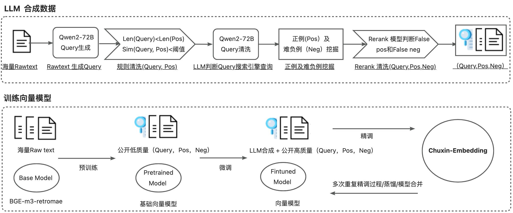

# Chuxin-Embedding

<!-- Provide a quick summary of what the model is/does. -->
Chuxin-Embedding 是专为增强中文文本检索能力而设计的嵌入模型。它基于bge-m3-retromae[1]，实现了预训练、微调、精调全流程。该模型在来自各个领域的大量语料库上进行训练，语料库的批量非常大。截至 2024 年 9 月 14 日, Chuxin-Embedding 在检索任务中表现出色，在 C-MTEB 中文检索排行榜上排名第一，领先的性能得分为 77.88，在AIR-Bench中文检索+重排序公开排行榜上排名第一，领先的性能得分为 64.78。

## News
- 2024/9/14: LLM生成及数据清洗 [Code](https://github.com/chuxin-llm/Chuxin-Embedding) coming soon 。
- 2024/9/14: 团队的RAG框架欢迎试用 [ragnify](https://github.com/chuxin-llm/ragnify) 。 

## Training Details

基于bge-m3-retromae[1]，主要改动如下：
<!-- Provide a longer summary of what this model is. -->
- 基于bge-m3-retromae[1]在亿级数据上预训练。
  - 使用BGE pretrain [Code](https://github.com/FlagOpen/FlagEmbedding/tree/master/examples/pretrain) 完成预训练。
- 在收集的公开亿级检索数据集上实现了微调。
  - 使用BGE finetune [Code](https://github.com/FlagOpen/FlagEmbedding/tree/master/examples/finetune) 完成微调。
- 在收集的公开百万级检索数据集和百万级LLM合成数据集上实现了精调。
  - 使用BGE finetune [Code](https://github.com/FlagOpen/FlagEmbedding/tree/master/examples/finetune) 和 BGE unified_finetune [Code](https://github.com/FlagOpen/FlagEmbedding/tree/master/examples/unified_finetune) 完成精调。
  - 通过 LLM (QWEN-72B) 进行数据生成，使用 LLM 为message生成新query
  - 数据清洗：
    - 简单的基于规则清洗
    - LLM判断是否可作为搜索引擎查询的query 
    - rerank模型对(query,message)评分，舍弃pos中的负例，neg中的正例
    
## Collect more data for retrieval-type tasks
1. 预训练数据
      - ChineseWebText、 oasis、 oscar、 SkyPile、 wudao 
2. 微调数据
      - MTP 、webqa、nlpcc、csl、bq、atec、ccks
3. 精调数据
      - BGE-M3 、Huatuo26M-Lite 、covid ...
      - LLM 合成（BGE-M3 、Huatuo26M-Lite 、covid、wudao、wanjuan_news、mnbvc_news_wiki、mldr、medical QA...）


## Performance
**C_MTEB RETRIEVAL**
| Model                 | **Average** | **CmedqaRetrieval** | **CovidRetrieval** | **DuRetrieval** | **EcomRetrieval**   | **MedicalRetrieval** | **MMarcoRetrieval** | **T2Retrieval** | **VideoRetrieval** |
| :-------------------: | :---------: | :-------: | :------------: | :-----------: | :-----------: | :-------: | :----------: | :-------: | :----------: |
| Zhihui_LLM_Embedding | 	76.74       | 48.69     | 84.39          | 91.34         | 71.96         | 65.19     | 84.77        |88.3     | 79.31        |
|   zpoint_large_embedding_zh  | 76.36       | 47.16     | 89.14          | 89.23         | 70.74          | 68.14     | 82.38        | 83.81     | 80.26        |
| **Chuxin-Embedding** | **77.88**  | 56.58     | 84.28          | 85.65         | 74.01         | 75.62     |   79.06   | 84.04   |   83.84    |


**AIR-Bench**
| Retrieval Method       |    Reranking Model      | **Average** | **wiki_zh** | **web_zh** | **news_zh** | **healthcare_zh**   | **finance_zh** |
| :-------------------: | :---------:| :---------: | :-------: | :------------: | :-----------: | :-----------: | :----------: |
| bge-m3 | bge-reranker-large	|   64.53   | 76.11     |     67.8      | 63.25        |    62.9      |    52.61   |
| gte-Qwen2-7B-instruct  |bge-reranker-large |   63.39    | 78.09     |    67.56     | 63.14         |   61.12    | 47.02    |
| **Chuxin-Embedding** | bge-reranker-large | **64.78** |76.23     | 68.44          |     64.2    | 62.93         | 52.11     |


## Generate Embedding for text
```python
from FlagEmbedding import BGEM3FlagModel

model = BGEM3FlagModel('chuxin-llm/Chuxin-Embedding',  
                       use_fp16=True) # Setting use_fp16 to True speeds up computation with a slight performance degradation

sentences_1 = ["样例数据-1", "样例数据-2"]
sentences_2 = ["样例数据-3", "样例数据-1"]

embeddings_1 = model.encode(sentences_1, 
                            batch_size=12, 
                            max_length=1024, 
                            )['dense_vecs']
embeddings_2 = model.encode(sentences_2)['dense_vecs']
similarity = embeddings_1 @ embeddings_2.T
print(similarity)

```

<!-- Address questions around how the model is intended to be used, including the foreseeable users of the model and those affected by the model. -->

### Reference
1. https://huggingface.co/BAAI/bge-m3-retromae
2. https://github.com/FlagOpen/FlagEmbedding/tree/master/FlagEmbedding/BGE_M3
3. https://github.com/FlagOpen/FlagEmbedding/tree/master/FlagEmbedding/baai_general_embedding
<!-- This section is for the model use without fine-tuning or plugging into a larger ecosystem/app. -->
